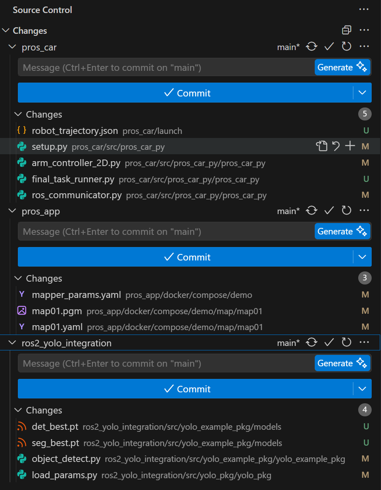

# PROS Final Project: Racing2026 - Develop Context

## 專案概述 (Project Overview)
本專案目標是在 Unity 虛擬環境中的 `Racing2026` 地圖完成 Final Project 的三大任務。
`Racing2026` 地圖的特性是：**橋與路的座標固定**，但是**熊 (Bear) 的位置是隨機的**。
因此實作策略為：「大範圍依賴 SLAM/Nav2 導航配合固定點 (Waypoints)，小範圍依賴 YOLO 與視覺伺服 (Visual Servoing) 進行精確靠近，最後使用逆向運動學 (IK) 控制機械臂夾取/觸碰」。

## 工作空間架構 (Workspace Architecture)
專案底下分為三個主要的子環境，均透過 Docker/ROS2 運行：
1. **`pros_app/` (系統層與建圖/定位)**：
   - 使用 `control.py -s` 呼叫以下 bash 腳本。
   - `rosbridge_server.sh`: 與 Unity 溝通的橋樑。
   - `slam_unity.sh`: 建置圖資。
   - `store_map.sh`: 儲存建立好的圖資。
   - `localization_unity.sh`: 讀取圖資進行定位，給予約束點 (Initial Pose) 後配合 Nav2 導航。
2. **`pros_car/` (車體底盤與機械臂控制)**：
   - 負責建置並發布 cmd_vel 控制底盤，以及 Joint / Task Space 控制機械臂。
   - `car_controller.py`: 處理自駕邏輯 (`manual_auto_nav`, `target_auto_nav`)。
   - `arm_controller.py`, `ik_solver.py`: 處理機械臂正向/逆向運動學 (包含 Task Space Control 來精準控制末端點)。
3. **`ros2_yolo_integration/` (視覺與感知)**：
   - 負責從相機訂閱影像並發布 Bounding Box。
   - 對接 `/yolo/detection/compressed` 取得結果。
   - 需要將模型 (`.pt`) 放入 `src/yolo_example_pkg/models/`，並改寫引用的模型檔名與對應的 Class ID。

## 任務拆解與架構演進 (Task Breakdown & Architecture Evolution)

### 原始規劃 (依靠 Nav2)
一開始計畫是利用 Nav2 來依序導航至 Task 1 (平地找熊)、Task 2 (橋上找熊) 與 Task 3 (門前)，並在到達後切換至 YOLO Visual Servo。但實際執行時發現，**Unity 虛擬環境中的橋與斜坡會被 SLAM/Nav2 誤認為障礙物**，導致導航完全失效卡死。

### 目前的實作架構 (純手工 PID 軌跡導航)
為了克服 Nav2 的地形辨識問題，我們在 `final_task_runner.py` 中實作了**完全捨棄 Nav2，僅依靠 AMCL 初始定位，並全程使用手工 PID 序列 (Dead Reckoning + PID)** 的導航方案。

目前程式會執行以下序列 (`sequence` list)：
1. **取得基準座標**：啟動時讀取 AMCL 計算出的絕對起始座標與朝向。
2. **手動軌跡執行 (Trajectory Execution)**：
   - 使用 `drive_straight` 搭配雷射防撞牆 (`stop_at_wall_dist`) 直線行駛上橋、過橋、下橋。
   - 使用 `rotate_to_yaw` 控制定點轉向，搭配 PID 確保朝向精準。
   - 透過精確的距離推演 (例如：直走 1.0m → 左轉 90° → 直走過橋 3.0m → 右轉 90° → 直走 0.7m → 右轉 80° → 直走 1.5m → 左轉 80° → 直走 1.5m) 一路精準開到 Task 3 的大門前。
3. **YOLO 開門程序 (Task 3: Unlock & Clear)**：
   - 抵達門前時，切換至 YOLO 視覺對齊，詳細開門與過門邏輯已在下方的「實際開發歷程與優化紀錄」中詳述。

---

## 需要人類使用者先完成的準備工作 (Manual Prerequisites)
接手開發的 Agent 必須向使用者確認以下 4 個要件是否齊全，再開始產生對應的自動化腳本：
1. **地圖 (Map)**：是否已經依序開 Unity `Racing2026` -> 跑 `slam_unity.sh` -> 手動走完地圖 -> 跑 `store_map.sh`。
2. **關鍵座標 (Waypoints)**：提供 Task 1 搜尋區、Task 2 橋起點/終點、Task 3 門前的 `(x, y)` 座標。
3. **YOLO 權重與 ID**：模型 `.pt` 是否放入目標資料夾，且必須提供「熊」與「門鎖」的 Class ID。
4. **夾爪距離 (IK Threshold)**：夾熊和推門時，相機距離目標多遠要停下來？機械臂需要往前伸多少？

## Agent 接手指南 (Next Steps for AI Agents)
當上述 prerequisites 完成後，接下來的 AI Agent 應專注於維護並優化單一的整合腳本：
1. `pros_car/src/pros_car_py/pros_car_py/final_task_runner.py`

開發重點 (目前已轉移至純手工 PID 軌跡導航)：
- **維護手工軌跡 (`sequence` list)**：確保 `final_task_runner.py` 中的 `drive_straight` 與 `rotate_to_yaw` 各階段參數正確（包含距離、轉向角度與容忍誤差）。
- **維持靜摩擦力與飄移對策**：任何新的控制邏輯都必須繼承「最小輪速保證」與「防前飄補償」。
- **YOLO 開門最佳化**：維護基於離散角度修正的對齊機制 (`rotate_to_yaw`) 以及提早舉臂、盲走逼近、多次上下揮動的手眼協調邏輯。

---

## 實際開發歷程與優化紀錄 (Development & Optimization Log)

在實作 Final Task 尤其是**門把開門任務 (Task 3)** 與**純粹 PID 控制行走**時，遇到了許多物理與控制層面的挑戰。以下記錄了這些問題與最終的解決方案 (Workarounds)。

### 1. 靜摩擦力過大 (Static Friction Issue)
- **問題**：車體底盤在 Unity 中有極大的靜摩擦力，當 PID 輸出的控制力道小於 220.0 時，車子完全不會動，導致細微的轉向與前進命令失效。
- **解決方案**：在 `rotate_to_yaw` 與 `drive_straight` 中實作了**最小輪速保證**。只要誤差大於容忍範圍，強制要求馬達輸出至少 `MIN_ROTATE_SPEED = 220.0` 或 `MIN_FORWARD_SPEED = 220.0`。
- **優化**：針對原地旋轉卡住的問題，將積分係數 `Ki` 從 15.0 大幅提高到 `80.0`，並將積分上限縮緊至 10.0。這使得車輛在遇到輕微卡頓時，積分項能瞬間累積出極大爆發力（最高可疊加 800），迅速突破靜摩擦力。

### 2. Skid-steer 原地旋轉前飄問題 (Drifting Forward During Rotation)
- **問題**：尋找門把的掃描與 YOLO 對齊過程中，原地旋轉 (左右輪等速反轉) 會因為摩擦力不對稱，導致車子不斷往前蠕動 (Creeping)，嚴重時會撞上牆壁卡死。
- **解決方案 (Drift Compensation)**：在 `rotate_to_yaw` 開始時記錄下原點 `(start_x, start_y)`，並在旋轉迴圈中實時計算偏移量並投影到車頭方向 (`forward_drift`)。接著加上一個往後的 P 控制器補償 `v_drift_comp` 疊加到兩輪的輸出上。這就像一個隱形的繩子把車子拉在原地，達成真正完美的定點自轉。

### 3. YOLO 精準對齊機制 (Precise YOLO Alignment)
- **問題**：直接使用畫面中心誤差來控制 `cmd_vel` 時常因為速度過慢而受限於靜摩擦力，或是因為過衝而無法收斂。
- **解決方案**：不採用連續的視覺伺服，而是改用「離散修正法」。取得 YOLO 門把中心 `delta_x` 後，透過 `PIXEL_TO_DEG` 粗略換算成角度誤差（約 `delta_x * 0.094` 度），然後丟給已經克服靜摩擦力的 `rotate_to_yaw` 轉向。重複此步驟直到 `delta_x < 30.0px`，極大提高了對齊穩定度。

### 4. 機械臂與車體互動物理干擾 (Arm Physics Interference)
- **問題**：如果在車子停在門把前才舉起機械臂，機械臂改變姿勢的瞬間反作用力會將車子推離門把，導致最終無法按壓門把。此外，行駛過程中機械手臂的手腕 (Wrist) 會因為沒有收到指令而因為物理重力自然下垂。
- **解決方案**：
  1. **提早舉臂**：在確認對齊門把後，**還沒開始前進前**，就提早呼叫 `move_end_effector` 把手臂往前伸，並設定較高的 `z_offset=0.10` 確保高於門把。
  2. **深度精準盲走**：取得 YOLO 提供之距離深度 `target_depth` 後，計算 `drive_distance = target_depth - 0.20m`。然後直接使用 `drive_straight(drive_distance)` 帶著舉起的手臂盲走過去，完全避免了手臂行駛中下垂的問題。
  3. **多次上下揮動 (Multiple Swings)**：到達精準位置後，不再只是放開手臂。改為讓手臂以 `z_offset = -0.15` 到 `0.15` 之間大幅度上下揮動 3 次，極大提升物理碰撞觸發門把機關的成功率。
  4. **PID 穩定過門**：取代原先直接給輪速 `600` 無腦暴衝容易卡門框的問題，通過門把後改用 `drive_straight(2.0)` 直線穩定駛入房間。

### 5. Git 版本控制整合紀錄 (Monorepo)
為了方便後續開發與管理，我們將原先獨立 clone 下來的三個專案（`pros_app`、`pros_car`、`ros2_yolo_integration`）的 `.git` 目錄移除，並將所有自訂修改一併納入目前的 `pros` 專案中（採用單一 Repo 形式）。

在移除各子專案的 `.git` 之前，這三個專案的最後提交版本號如下：
- `pros_app`: `2e25eeb` (don't auto activate rosbridge)
- `pros_car`: `3659e63` (speed change)
- `ros2_yolo_integration`: `0acc4f1` (add cuda128)

以下是整合過程中的狀態參考：

