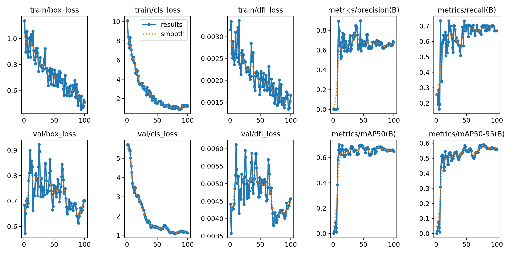
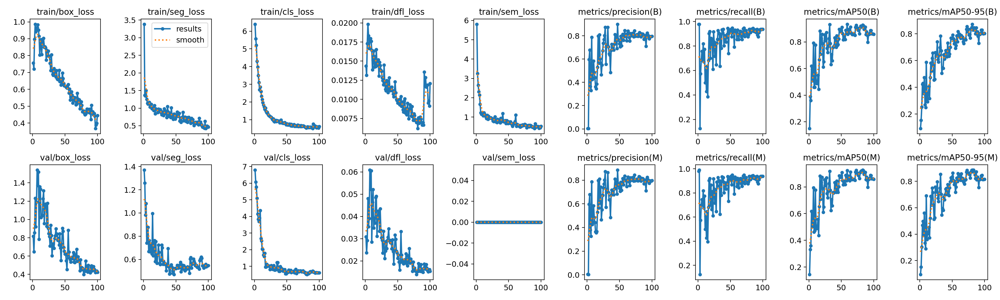
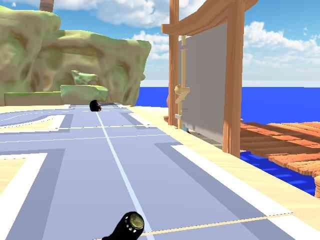
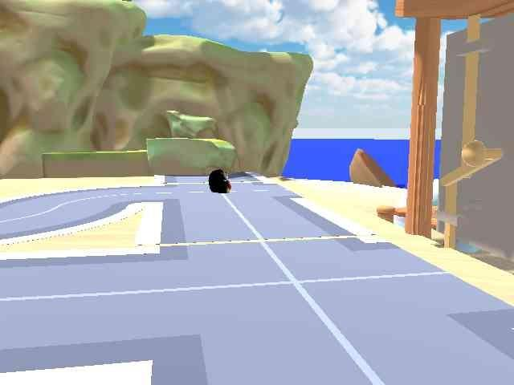
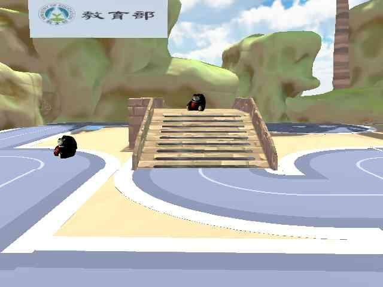
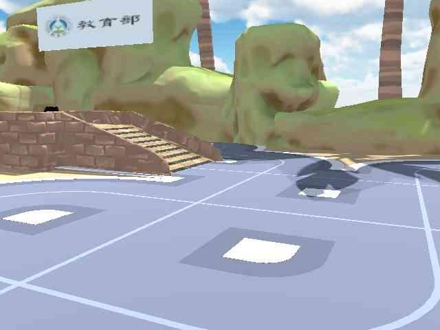

# Robotic Navigation and Exploration - HW4

### 簡誌加 N26140692

---

## 1. Roboflow Projects & Dataset Configuration

* **Roboflow Projects**:
  * [Detection Project Link](https://universe.roboflow.com/n26140692s-workspace/jackiempty-det)
  * [Segmentation Project Link](https://universe.roboflow.com/n26140692s-workspace/jackiempty-seg)

* **Dataset Configuration (Detection)**:
  * **Images Count (Total)**: `115`
  * **Object Categories (nc)**: `[2: bear, knob]`
  * **Train/Validation/Test Split**: `85% / 15%`

---

* **Dataset Configuration (Segmentation)**:
  * **Images Count (Total)**: `341`
  * **Object Categories (nc)**: `2: road, bridge`
  * **Train/Validation Split**: `80% / 20%`

---

## 2. YOLO Training Configuration (Detection)

* **Model Type**: YOLO26 Nano (`yolo26n.pt`)
* **Epochs**: 100
* **Batch Size**: 8
* **Optimizer**: Auto

---

## 3. YOLO Training Configuration (Segmentation)

* **Model Type**: YOLO26 Nano (`yolo26n-seg.pt`)
* **Epochs**: 100
* **Batch Size**: 8
* **Optimizer**: Auto

---

## 4. Dataset Diversity (Detection)

* **Description (資料多樣性說明)**:
  本資料集涵蓋了在各種不同距離與視角下所拍攝的 `bear` 與 `knob`。為了確保模型在實際機器人導航的場景中具備良好的泛化能力 (Generalization)，影像中納入了多樣的背景材質、變化的光線條件（偏暗與明亮照明均有），並包含了部分物件被輕微遮蔽挑戰的真實場景。

---

* **Example Images**:

 

---

## 5. Dataset Diversity (Segmentation)

* **Description (資料多樣性說明)**:
  為提升機器人的可行駛區域辨識穩定度，分割資料集專注於精確標註 `road`（道路）與 `bridge`（橋樑）。收集的數據涵蓋了多變的地板材質、不同遠近的高低視角、以及地面邊緣模糊與反光的複雜情境，使分割模型能在未知的地形中對環境路徑區域進行高強度的像素級預測。

---

* **Example Images**:

 

---
## 6. Final Project: Navigation Strategy

* **Strategy Description (導航策略描述)**:  
  在 Final Project 中，我們提出了一套**語意感知動態避障導航策略 (Semantic-Aware Dynamic Navigation)**。這套策略融合了兩種視覺模型：首先依賴 Segmentation 模型提取 `road` 與 `bridge`，在地圖上預先界定出安全的全局行駛走廊；同時運行 Detection 模型即時掃描前方視野。當偵測到危險物件或未知干擾（如 `bear`）時，系統會從 Depth Camera 提取該物件的深度並投影至 Local Costmap，給予高權重的排斥域，觸發 RT* 進行即時閃避繞行；一旦鎖定互動目標（如 `knob`），則將其設為新的局部導航終點，實現「在已知道路上高速行駛，同時靈活應對突發障礙並精準定位目標」的智慧探索架構。

* **Algorithm (核心演算法流程)**:
  1. 使用 YOLO 進行物體偵測與辨識 (熊/旋鈕等目標)。
  2. 結合 Depth Camera / Lidar 獲取深度資訊並標定世界座標。
  3. 將偵測到的障礙物建立為成本地圖 (Costmap) 或排斥域。
  4. 利用 **RT\*** 計算出前往目標的最優路徑。
